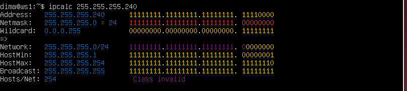
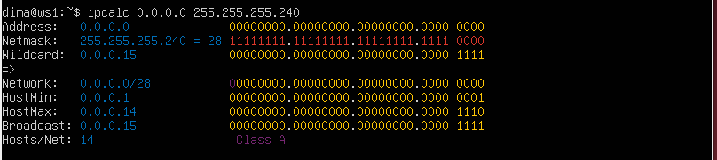
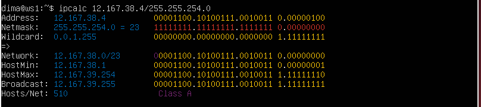
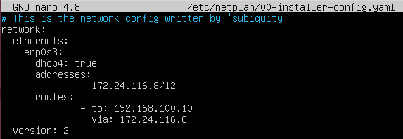
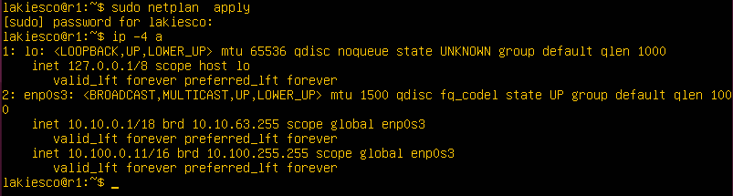
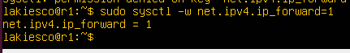
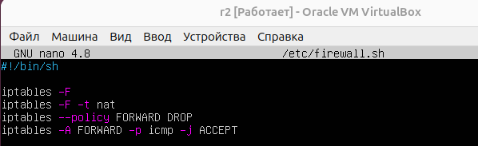
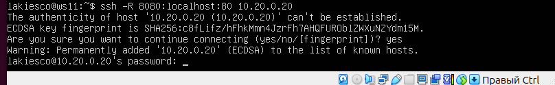

## Part 1. Инструмент ipcalc

* Поднята виртуальная машина ws1.

**1.1. Сети и маски**

1. адрес сети 192.167.38.54/13

  * Адрес сети находиться в поле `Aaddress: 192.167.38.54`

2. Для перевода маски 255.255.255.0 в префиксную и двоичную запись выполним команду: `ipcalc 255.255.255.0`

* Для перевода /15 в обычную и двоичную запись выполним команду: `ipcalc /15`

* Для перевода 11111111.11111111.11111111.11110000 в обычную запись выполним команду: `ipcalc 255.255.255.240` 

* Для перевода 11111111.11111111.11111111.11110000 в префиксную запись выполним команду: `ipcalc 0.0.0.0 255.255.255.240`

   Перевод 11111111.11111111.11111111.11110000 в обычную и префиксную запись

3. Определяем минимальный и максимальный хост в сети 12.167.38.4 при масках: /8, 11111111.11111111.00000000.00000000, 255.255.254.0 и /4

* В сети 12.167.38.4 при маске: /8
    * Минимальный хост 12.0.0.1
    * Максимальный хост: 12.255.255.254

 * В сети 12.167.38.4 при маске: 11111111.11111111.00000000.00000000 (так как команда ipcalc не принимает маски в двоичной записи переводим исходную маску в обычную запись и можем использовать либо /255.255.0.0, либо /16)
    * Минимальный хост 12.167.38.1
    * Максимальный хост: 12.167.39.254

* В сети 12.167.38.4 при маске: 255.255.254.0 
  * Минимальный хост 12.167.38.1
  * Максимальный хост 12.167.39.254

* В сети 12.167.38.4 при маске: /4
  * Минимальный хост 0.0.0.1  
  * Максимальный хост: 15.255.255.254 

**1.2. localhost**

* Определяем можно ли обратиться к приложению, работающему на localhost, со следующими IP: 194.34.23.100, 127.0.0.2, 127.1.0.1, 128.0.0.1, для этого используем команду `ping`

 

* К приложенияю можно обратиться по следующими IP:  
  * 127.0.0.2
  * 127.1.0.1

**1.3. Диапазоны и сегменты сетей**

1. Определяем какие из перечисленных IP можно использовать в качестве публичного, а какие только в качестве частных с помощью команды `ipcalc`: 

 

* В качестве публичного можно использовать следующие IP:
  * 134.43.0.2
  * 172.0.2.1
   * 192.172.0.1
  * 172.68.0.2
  * 192.169.168.1

* Только в качестве частных можно использовать следующие IP:

  * 10.0.0.45
  * 192.168.4.2 
  * 172.20.250.4
  *  172.16.255.255
  * 10.10.10.10

  2. Определяем какие из перечисленных IP адресов шлюза возможны у сети 10.10.0.0/18: 10.0.0.1, 10.10.0.2, 10.10.10.10, 10.10.100.1, 10.10.1.255

Таким образом, только адреса, которые находятся в пределах диапазона от 10.10.0.0 до 10.10.63.255, могут быть использованы в качестве шлюза для  сети `10.10.0.0/18`

  * **Анализ адресов:**
  * Входят в диапазон возмоные адреса шлюза: 
    * 10.10.0.2
    * 10.10.10.10
    * 10.10.1.255

* 10.0.0.1: Не входит в диапазон (невозможный адрес)
* 10.10.100.1: Не входит в диапазон (невозможный адрес)

## Part 2. Статическая маршрутизация между двумя машинами

* Подняты две виртуальные машины ws1 и ws2

   

* С помощью команды ip a  просмотрены существующие сетевые интерфейсы 
* для ws1 

   

* для ws2 

   

* Описан сетевой интерфейс, соответствующий внутренней сети, на обеих машинах и заданы следующие адреса и маски: ws1 - 192.168.100.10,  маска /16, ws2 - 172.24.116.8, маска /12.

* Открываем  файл конфигурации сетевых интерфейсов и внести необходимые изменения c помощью команды `sudo nano /etc/netplan/00-installer-config.yaml` и редактируем:

* для ws1 

 

* для ws2 

 

* Выполнена команда `netplan apply` для перезапуска сервиса сети 

* для ws1 

 

* для ws2 

 

**2.1. Добавление статического маршрута вручную**

  * Добавили статический маршрут от одной машины до другой и обратно при помощи команды вида ip r add для ws1: `sudo ip r add 172.24.116.8 dev enp0s3` для ws2: `sudo ip r add 192.168.100.10 dev enp0s3`

* Пропинговали соединение между машинами с помощью команд ws1: `ping 172.24.116.8`, ws2: `ping 192.168.100.10` 

* для ws1 

 

* для ws2 

 

**2.2. Добавление статического маршрута с сохранением**

* Добавили статический маршрут от одной машины до другой с помощью файла etc/netplan/00-installer-config.yaml

* для ws1 

 

* для ws2 

 

* Выполнена команда `netplan apply` для перезапуска сервиса сети 

* для ws1 

 

* для ws2 

 

* Пропинговали соединение между машинами с помощью команд ws1: `ping -с 4 172.24.116.8`, ws2: `ping -с 4 192.168.100.10`, опция -c задает количество пакетов, которые будут отправлены в данном случае 4 пакета.

* для ws1 

 

* для ws2 

 

## Part 3. Утилита iperf3

**3.1. Скорость соединения** 

* Перевели и записали в отчет: 8 Mbps в MB/s, 100 MB/s в Kbps, 1 Gbps в Mbps.

  * 8 Mbps = 1 MB/s;
  * 100 MB/s = 800000 Kbps;
  * 1 Gbps = 1000 Mbps;

**3.2. Утилита iperf3** 

* Устанавливаем утилиту iperf3 командой `sudo apt install iperf3` на обе машины.

* На ws1 запускаем iperf3 в режиме сервера: iperf3 -s

 

* Теперь к ws1 можно подключаться по порту 5201 клиентам iperf3 с помощью команды:  `iperf3 -c 192.168.100.10`

 

* На ws1 также происходит вывод: 

 

* Измерели скорость соединения между ws1 и ws2

  * Скорость sender: 953Mbits/sec 
  * Скорость receiver: 951Mbits/sec

## Part 4. Сетевой экран

**4.1 Утилита iptables**

* Создан файл /etc/firewall.sh имитирующий фаерволл, на  ws1 и ws2.

* для ws1 

 

* для ws2 

 

* В файл добавлены подряд следующие правила: 

1) На ws1 примени стратегию, когда в начале пишется запрещающее правило, а в конце пишется разрешающее правило (это касается пунктов 4 и 5).

2) На ws2 примени стратегию, когда в начале пишется разрешающее правило, а в конце пишется запрещающее правило (это касается пунктов 4 и 5).

3) Открой на машинах доступ для порта 22 (ssh) и порта 80 (http).

4) Запрети echo reply (машина не должна «пинговаться», т. е. должна быть блокировка на OUTPUT).

5) Разреши echo reply (машина должна «пинговаться»).

  * Запустили файлы на обоих машинах командами  chmod +x 
  /etc/firewall.sh и
  /etc/firewall.sh

* для ws1 

 

* для ws2 

 

 * Разница между стратегиями:
    * ws1 (стратегия: запрещающее правило в начале, разрешающее правило в конце)
    * ws2 (стратегия: разрешающее правило в начале, запрещающее правило в конце) 
* Таким образом: На ws1 сначала запрещаются все входящие пакеты, а затем разрешаются необходимые пакеты. На ws2 сначала разрешаются все входящие пакеты, а затем запрещаются ненужные пакеты.

  **4.2. Утилита nmap** 

* Командой ping нашли машину, которая не "пингуется":
  
* для ws1 (пинг проходит)

 

* для ws2 (пинг не проходит)

 
  
 После чего утилитой nmap показываем, что хост машины запущен:

   * для ws11 

 

* для ws2 

 

  * Сохранили дампы образов виртуальных машин 

  ## Part 5. Статическая маршрутизация сети

  * Подняты пять виртуальных машин (3 рабочие станции (ws11, ws21, ws22) и 2 роутера (r1 и r2))

   

  **5.1. Настройка адресов машин**

 * согласно сети на рисунке

  

 * Настроены конфигурации машин в etc/netplan/00-installer-config.yaml 

  * для ws11

 

* для ws21

 

* для ws22

 

* для r1

 

* для r2

 

  * Перезапустили сервис сети. Если ошибок нет, то командой `ip -4 a` проверили, что адрес машины задан верно.

 * для ws11

 

* для ws21

 

* для ws22

 

* для r1

 

* для r2

 

  
  * Также пропингованы ws22 с ws21.
  
   

  * Аналогично пропингованы r1 с ws11.

   

  **5.2. Включена переадресация IP-адресов.**

  * Для включения переадресации IP, выполнена команда на роутерах:

  `sysctl -w net.ipv4.ip_forward=1`

  * На r1

 

* На r2

 

  * Открыли файл /etc/sysctl.conf. с помощью команды `sudo nano /etc/sysctl.conf ` и добавили в него следующую строку: `net.ipv4.ip_forward = 1`

  * На r1

 

* На r2

 

 **5.3. Установка маршрута по-умолчанию**

  * Настроен маршрут по-умолчанию (шлюз) для рабочих станций. Для этого добавлен default перед IP-роутера в файле конфигураций.

* для ws11

 

* для ws21

 

* для ws22

 

* Также добавили (шлюзы) для роутеров, чтобы пинг доходил в соседнюю сеть 

* для r1

 

* для r2

 

  * Вызван `ip r` и показано, что добавился маршрут в таблицу маршрутизации 

  * для ws11

 

* для ws21

 

* для ws22

 

* для r1

 

* для r2

 

  * Пропинговали с ws11 роутер r2 
  
 

  * И показали на r2, что пинг доходит. Для этого использовали команду: `tcpdump -tn -i enp0s3`

 

  **5.4. Добавление статических маршрутов**

  * Добавлены в роутеры r1 и r2 статические маршруты в файле конфигураций. Пример для r1 маршрута в сетку 10.20.0.0/26:

  * Для r1

   

  * Для r2

   

  * Вызван ip r и показаны таблицы с маршрутами на обоих роутерах. 

  * для r1

 

* для r2

 

  * Запущены команды на ws11: 

  `ip r list 10.10.0.0/[маска сети]` и `ip r list 0.0.0.0/0`

   

  * Для адреса 10.10.0.0/18 был выбран маршрут, отличный от 0.0.0.0/0, хотя он попадает под маршрут по умолчанию. Так как маршрут по умолчанию имеет более низкий приоритет и срабатывает, когда не найден подходящий маршрут в таблице маршрутизации. Для сети 10.10.0.0 было создано правило, соответственно используется созданный маршрут.

  **5.5. Построение списка маршрутизаторов**

  * На r1 запущена команда дампа: `tcpdump -tnv -i enp0s3`

   

  * При помощи утилиты traceroute построен список маршрутизаторов на пути от ws11 до ws21 
 
    

* Принцип работы утилиты traceroute:

  * Traceroute использует механизм TTL (Time to Live) в заголовках IP-пакетов.

  * На первом этапе утилита отправляет пакет с TTL = 1. Когда пакет доходит до первого маршрутизатора, TTL уменьшается до 0, и маршрутизатор отправляет ICMP-сообщение "Time Exceeded" обратно отправителю. Это позволяет выявить первый маршрутизатор.

  * На втором этапе отправляется пакет с TTL = 2, который доходит до второго маршрутизатора, там TTL также уменьшается до 0, и второй маршрутизатор отправляет ICMP-сообщение обратно. Так выявляется второй маршрутизатор.

  * Процесс повторяется, увеличивая TTL на единицу на каждом шаге, до тех пор, пока пакет не достигнет конечного узла (в данном случае ws21) или пока не будет достигнуто максимальное количество прыжков (обычно 30).

  * tcpdump на r1 показывает пакеты ICMP или UDP с уменьшением TTL при прохождении пакетов через маршрутизатор.

* Порядок работы следующий:

  * ws11 отправляет пакет с TTL = 1.

  * Пакет доходит до r1, TTL становится 0, и r1 отправляет обратно ICMP-сообщение "Time Exceeded", которое можно увидеть в tcpdump.

  * ws11 отправляет новый пакет с TTL = 2, который проходит дальше до следующего маршрутизатора, и процесс повторяется.

  * Таким образом, по выводу дампа можно наблюдать прохождение пакетов от ws11 до ws21 через промежуточные маршрутизаторы.

  **5.6. Использование протокола ICMP при маршрутизации**

  * Запустили на r1 перехват сетевого трафика, проходящего через enp0s3 с помощью команды: `tcpdump -n -i enp0s3 icmp`

   
  
  * Пропингованы с ws11 несуществующий IP (например, 10.30.0.111) с помощью команды: `ping -c 1 10.30.0.111`

   

  * Сохранили дампы образов виртуальных машин  

    ## Part 6. Динамическая настройка IP c помощью DHCP

    В задании используются виртуальные машины из части 5.

* С помощью команды `sudo apt install isc-dhcp-server` устанавливаем **isc-dhcp-server**

    * Для r2 настроили в файле /etc/dhcp/dhcpd.conf конфигурацию службы DHCP: 
     1. Указали адрес маршрутизатора по-умолчанию, DNS-сервер и адрес внутренней сети. 

     

    2. В файле resolv.conf прописали nameserver 8.8.8.8.

     

    * Перезагрузили службу DHCP командой `systemctl restart isc-dhcp-server` 

    

    * Машину ws21 перезагрузили при помощи reboot и через `ip a` показали, что она получила адрес.
    
    
    
   Также пропинговали ws22 с ws21.

    

    * Указали MAC адрес у ws11, для этого в etc/netplan/00-installer-config.yaml добавили строки: macaddress: 10:10:10:10:10:BA, dhcp4: true 

   

    * Для r1 настроили аналогично r2.

  1. Указали адрес маршрутизатора по-умолчанию, DNS-сервер и адрес внутренней сети. 

     

 2. В файле resolv.conf прописали nameserver 8.8.8.8.

     
    
* Перезагрузили службу DHCP командой `systemctl restart isc-dhcp-server` 

    

* Сделали выдачу адресов с жесткой привязкой к MAC-адресу (ws11). Провели аналогичные тесты

  

    * Запросили с ws21 обновление ip адреса

  

    * Сохранили дампы образов виртуальных машин  

  ## Part 7. NAT

  В задании используются виртуальные машины из части 5.

  * В файле /etc/apache2/ports.conf на ws22 и r1 изменили строку Listen 80 на Listen 0.0.0.0:80, то есть сделали сервер Apache 2 общедоступным 

  * Для ws22

   

 * Для r1

   

  * Запустили веб-сервер Apache командой `service apache2 start` на ws22 и r1 

* ws22 

  

* r1

  

  * Добавили фаерволл, созданный по аналогии с фаерволом из Части 4, на r2 следующие правила:

  1. Удаление правил в таблице filter - `iptables -F`

  2. Удаление правил в теблице "NAT" - `iptables -F -t nat` 

  3. Отбрасывать все маршрутизируемые пакеты - `iptables --policy FORWARD DROP`
 
  

 *  Запустили файл также как в Части 4

  

 * Проверели соединение между ws22 и r1 командой ping (При запуске файла с этими правилами, ws22 не пингуется с r1.)

  

 * Добавили в файл еще одно правило: 

  4. Разрешили маршрутизацию всех пакетов протокола ICMP

  

  *  Запустили файл также как в Части 4

   

 * Проверено соединение между ws22 и r1 и командой ping (При запуске файла с этими правилами, ws22 должна пингуется с r1.) 

   

 * Добавили в файл еще два  правила: 

 5. Включить SNAT, a именно маскирование всех локальных ip из локальной сети, находящейся за r2(по обозначениям из Части 5 - сеть 10.20.0.0)

 6. Включить DNAT на 8080 порт машины r2 и добавить к веб-серверу Apache, запущенному на ws22, доступ извне сети 

    

  *  Запустили файл также как в Части 4

  

* Проверили соединение по TCP для SNAT: для этого с ws22 подключились к серверу Apache на r1 командой: telnet [адрес] [порт], а именно `sudo telnet 10.100.0.11 80`

    

  * Проверели соединение по TCP для DNAT: для этого с r1 подключились к серверу Apache на ws22 командой telnet (обращаться по адресу r2 и порту 8080). Воспользовались командой: `telnet 10.100.0.12 8080`

     

   * Сохранили дампы образов виртуальных машин  

## Part 8. Дополнительно. Знакомство с SSH Tunnels

* В задании используются виртуальные машины из части 5.

* Запустили на r2 фаервол с правилами из Части 7

   

  

* Запустили веб-сервер Apache на ws22 только на localhost (то есть в файле /etc/apache2/ports.conf изменить строку Listen 80 на Listen localhost:80)

 * Внесли изменения в файл 

   

 * Запустили веб-сервер с помощью команды `service apache2 start`

   

* Воспользовались Local TCP forwarding c ws21 до ws22, чтобы получить доступ к веб-серверу на ws22 с ws21  c помощью команды `ssh -L 8080:localhost:80 10.20.0.20`

   

* Воспользовались Remote TCP forwarding с ws11 до ws22, чтобы получить доступ к веб-серверу ws22 с ws11 с помощью команды `ssh -R 8080:localhost:80 10.20.0.20`

* Ввели команду 

  

  

* Для проверки, сработало ли подключение в обоих предыдущих пунктах, перейдем во второй терминал (например клавишами Alt + F2) и выполним команду: `telnet 127.0.0.1 [локальный порт]`

  

   * Сохранили дампы образов виртуальных машин  

